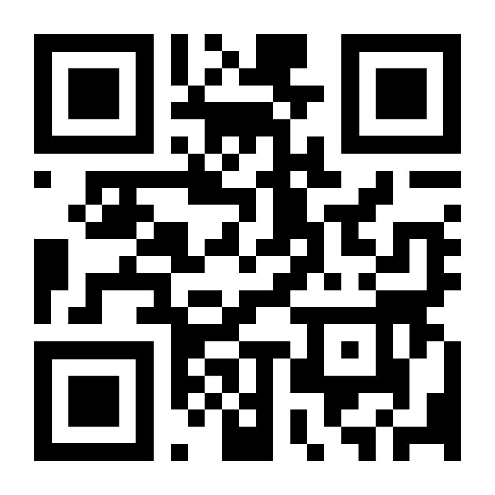
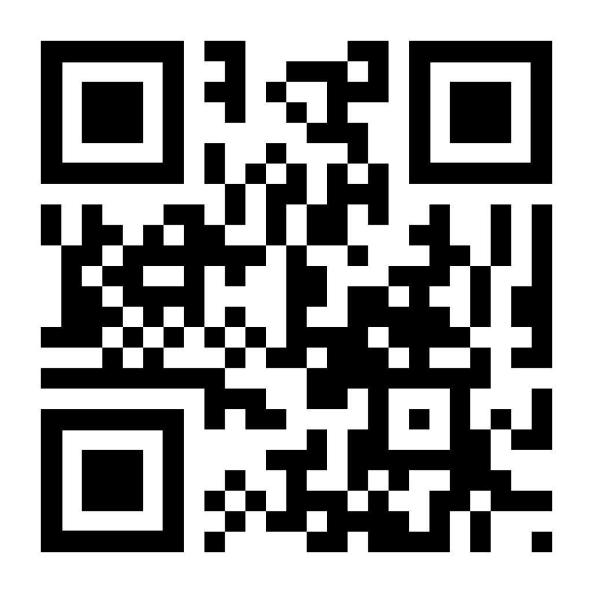

# Interacción en Realidad Aumentada con Figuras de Origami

Este proyecto, desarrollado para la asignatura de Sistemas de Gráficos Interactivos (SGI) en el Máster en Ingeniería Informática de la Universidad Politécnica de Cataluña (UPC), consiste en una aplicación de realidad aumentada que permite a los usuarios interactuar con dos figuras de origami virtuales.

## Funcionalidad

Cada figura ofrece una interacción distinta:

* **Figura 1 (Cangrejo):** Permite modificar su tamaño dinámicamente.
* **Figura 2 (Tortuga):** Puede rotarse en distintas direcciones.

Además, ambas figuras cuentan con un botón independiente que, al ser presionado, muestra una animación paso a paso del proceso de plegado del papel hasta llegar a la forma final.

## Targets de Realidad Aumentada

Aquí están los targets que se deben escanear en la aplicación para visualizar las figuras en realidad aumentada.

### Cangrejo

### Tortuga

## Descarga de la Aplicación

Puedes descargar la aplicación para probar la experiencia en realidad aumentada en tu dispositivo Android desde el siguiente enlace:

🔗 [Descargar APK](./proyectoRA_origami.apk)

Este proyecto combina técnicas avanzadas de gráficos interactivos y realidad aumentada para crear una experiencia inmersiva y educativa, destacando la fusión entre arte tradicional y tecnología.
